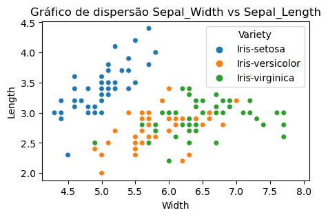
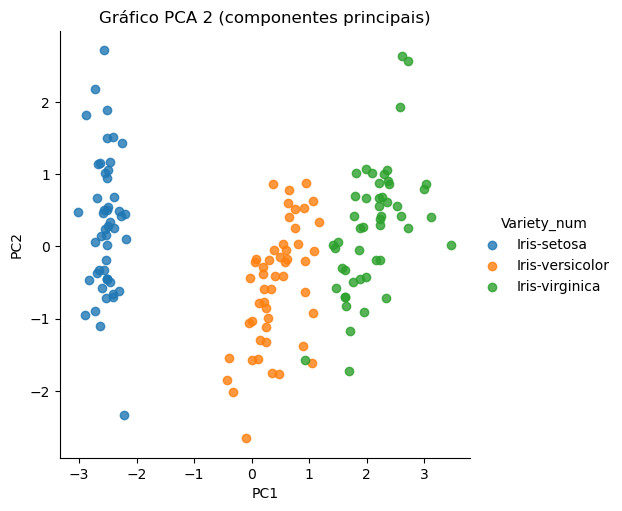

<div align="center">
    <h1>Atividade 1 - Caio Sousa Mendes </h1>
    <h3>ENGG67- T01 - Tópicos especiais em engenharia de computação </h3>
    <h4>Prof.: Antônio C. L. Fernandes Júnior</h4>
</div>

Para a resolução dos questionamentos utilizaremos bibliotecas como o <b> pandas </b> e o <b> numpy </b> no python para auxiliar na analise dos dados. <br>

Abaixo temos a inicialização do banco de dados com uma pré visualização de 10 objetos aleatórios.


```python
import pandas as pd
import numpy as np
import matplotlib.pyplot as plt
import seaborn as sns

dados = 'https://archive.ics.uci.edu/ml/machine-learning-databases/iris/iris.data'

atributos = ['Sepal_Length','Sepal_Width','Petal_Length','Petal_Width','Variety']

iris =  pd.read_csv(dados, names = atributos)

iris_Variety = iris['Variety']

iris.sample(10)


```


<div>
<table border="1" class="dataframe">
  <thead>
    <tr style="text-align: right;">
      <th></th>
      <th>Sepal_Length</th>
      <th>Sepal_Width</th>
      <th>Petal_Length</th>
      <th>Petal_Width</th>
      <th>Variety</th>
    </tr>
  </thead>
  <tbody>
    <tr>
      <th>7</th>
      <td>5.0</td>
      <td>3.4</td>
      <td>1.5</td>
      <td>0.2</td>
      <td>Iris-setosa</td>
    </tr>
    <tr>
      <th>13</th>
      <td>4.3</td>
      <td>3.0</td>
      <td>1.1</td>
      <td>0.1</td>
      <td>Iris-setosa</td>
    </tr>
    <tr>
      <th>27</th>
      <td>5.2</td>
      <td>3.5</td>
      <td>1.5</td>
      <td>0.2</td>
      <td>Iris-setosa</td>
    </tr>
    <tr>
      <th>89</th>
      <td>5.5</td>
      <td>2.5</td>
      <td>4.0</td>
      <td>1.3</td>
      <td>Iris-versicolor</td>
    </tr>
    <tr>
      <th>125</th>
      <td>7.2</td>
      <td>3.2</td>
      <td>6.0</td>
      <td>1.8</td>
      <td>Iris-virginica</td>
    </tr>
    <tr>
      <th>61</th>
      <td>5.9</td>
      <td>3.0</td>
      <td>4.2</td>
      <td>1.5</td>
      <td>Iris-versicolor</td>
    </tr>
    <tr>
      <th>5</th>
      <td>5.4</td>
      <td>3.9</td>
      <td>1.7</td>
      <td>0.4</td>
      <td>Iris-setosa</td>
    </tr>
    <tr>
      <th>19</th>
      <td>5.1</td>
      <td>3.8</td>
      <td>1.5</td>
      <td>0.3</td>
      <td>Iris-setosa</td>
    </tr>
    <tr>
      <th>113</th>
      <td>5.7</td>
      <td>2.5</td>
      <td>5.0</td>
      <td>2.0</td>
      <td>Iris-virginica</td>
    </tr>
    <tr>
      <th>37</th>
      <td>4.9</td>
      <td>3.1</td>
      <td>1.5</td>
      <td>0.1</td>
      <td>Iris-setosa</td>
    </tr>
  </tbody>
</table>
</div>


<b> a. Caracterize os dados quanto ao Tipo e Escala</b>
    
     Atributo:     Tipo      -  Escala
    
     sepal.length: Numérico  -  Racional
     sepal.width:  Numérico  -  Racional
     petal.length: Numérico  -  Racional
     petal.width:  Numérico  -  Racional
     Variety:      Categórico - Nominal
    

<b> b. O conjunto de dados é univariado ou multivariado?
    
Multivariado, pois cada objeto tem cinco atributos.
    

<b> c. Verifique a necessidade de balanceamento dos dados e caracterize estatisticamente os
dados
    
 Não há necessidade de balanceamento, pois os objetos estão igualmente distribuidos (50 objetos para cada espécie) do atributo "Variety" (setosa, versicolor e virginica). 
    
    


<b> d. Analise os dados quanto à sua incompletude, inconsistências, redundâncias e presença
de ruído;


Com o método <b>describe()</b> podemos gerar uma tabela com informações resumidas por atributo do banco de dados para análise.


```python
iris.head()

iris.describe()
```


<div>

<table border="1" class="dataframe">
  <thead>
    <tr style="text-align: right;">
      <th></th>
      <th>Sepal_Length</th>
      <th>Sepal_Width</th>
      <th>Petal_Length</th>
      <th>Petal_Width</th>
    </tr>
  </thead>
  <tbody>
    <tr>
      <th>count</th>
      <td>150.000000</td>
      <td>150.000000</td>
      <td>150.000000</td>
      <td>150.000000</td>
    </tr>
    <tr>
      <th>mean</th>
      <td>5.843333</td>
      <td>3.054000</td>
      <td>3.758667</td>
      <td>1.198667</td>
    </tr>
    <tr>
      <th>std</th>
      <td>0.828066</td>
      <td>0.433594</td>
      <td>1.764420</td>
      <td>0.763161</td>
    </tr>
    <tr>
      <th>min</th>
      <td>4.300000</td>
      <td>2.000000</td>
      <td>1.000000</td>
      <td>0.100000</td>
    </tr>
    <tr>
      <th>25%</th>
      <td>5.100000</td>
      <td>2.800000</td>
      <td>1.600000</td>
      <td>0.300000</td>
    </tr>
    <tr>
      <th>50%</th>
      <td>5.800000</td>
      <td>3.000000</td>
      <td>4.350000</td>
      <td>1.300000</td>
    </tr>
    <tr>
      <th>75%</th>
      <td>6.400000</td>
      <td>3.300000</td>
      <td>5.100000</td>
      <td>1.800000</td>
    </tr>
    <tr>
      <th>max</th>
      <td>7.900000</td>
      <td>4.400000</td>
      <td>6.900000</td>
      <td>2.500000</td>
    </tr>
  </tbody>
</table>
</div>


A partir da tabela, podemos afirmar sobre:

    Incompletude: Não existe, todos os atributos estão com 150 objetos com valores não nulos.
    
    Inconsistências: Avaliando os valores mínimo e máximo, não há presença de valores negativos por ser unidade de medida. 
    
    Redundancias: Cada atributo fornece uma informação útil e único, então não existe atributos redundantes.
    


Para a presença de ruído, vamos gerar um gráfico de dispersão para os atributos "Sepal_Length" e "Sepal_Width" para análise.


```python
plt.figure(figsize=(5,3))
sns.scatterplot(data = iris, x = 'Sepal_Length', y = 'Sepal_Width', hue = 'Variety', s = 30)
plt.title("Gráfico de dispersão Sepal_Width vs Sepal_Length")
plt.xlabel('Width')
plt.ylabel('Length')
plt.show()
```


    

    


    Presença de ruído: A partir do gráfico de dispersão para esse par de atributos, é possivel identificar alguns objetos mais afastados da concentração maior da sua mesma "Variety". Com isso, há indícios de dados ruidosos mas não podemos afirmar com certeza.

<b> e. Promova uma transformação de dados consistente com o banco sob análise

Transformação de dados categóricos para dados numéricos:
    
    Setosa: 0
    Versicolor: 1
    Virginica: 2
    


```python
transformacao = {'Iris-setosa': 0, 'Iris-versicolor': 1, 'Iris-virginica': 2}

iris['Variety_num'] = iris['Variety'].map(transformacao)
iris = iris.drop(columns = 'Variety')
iris.sample(5)
```


<div>

<table border="1" class="dataframe">
  <thead>
    <tr style="text-align: right;">
      <th></th>
      <th>Sepal_Length</th>
      <th>Sepal_Width</th>
      <th>Petal_Length</th>
      <th>Petal_Width</th>
      <th>Variety_num</th>
    </tr>
  </thead>
  <tbody>
    <tr>
      <th>141</th>
      <td>6.9</td>
      <td>3.1</td>
      <td>5.1</td>
      <td>2.3</td>
      <td>2</td>
    </tr>
    <tr>
      <th>72</th>
      <td>6.3</td>
      <td>2.5</td>
      <td>4.9</td>
      <td>1.5</td>
      <td>1</td>
    </tr>
    <tr>
      <th>22</th>
      <td>4.6</td>
      <td>3.6</td>
      <td>1.0</td>
      <td>0.2</td>
      <td>0</td>
    </tr>
    <tr>
      <th>75</th>
      <td>6.6</td>
      <td>3.0</td>
      <td>4.4</td>
      <td>1.4</td>
      <td>1</td>
    </tr>
    <tr>
      <th>111</th>
      <td>6.4</td>
      <td>2.7</td>
      <td>5.3</td>
      <td>1.9</td>
      <td>2</td>
    </tr>
  </tbody>
</table>
</div>


<b> f.  Utilize a análise de componentes principais (PCA) para gerar gráficos no espaço de
atributos.


```python
from sklearn.decomposition import PCA
from sklearn.preprocessing import StandardScaler

pca = PCA(n_components=2)

iris_scaled = StandardScaler().fit_transform(iris)

pca_features = pca.fit_transform(iris_scaled)

pca_df = pd.DataFrame(
    data=pca_features, 
    columns=['PC1', 'PC2'])

variety_names = {
    0:'Iris-setosa',
    1:'Iris-versicolor', 
    2:'Iris-virginica'
}

pca_df['Variety_num'] = iris['Variety_num'] 
pca_df['Variety_num'] = pca_df['Variety_num'].map(variety_names)


sns.lmplot(
    x='PC1', 
    y='PC2', 
    data=pca_df, 
    hue='Variety_num', 
    fit_reg=False
    )

plt.title('Gráfico PCA 2 (componentes principais)')
plt.show()
```

    C:\Users\caios\anaconda3\Lib\site-packages\seaborn\axisgrid.py:118: UserWarning: The figure layout has changed to tight
      self._figure.tight_layout(*args, **kwargs)
    


    

    


```python

```
